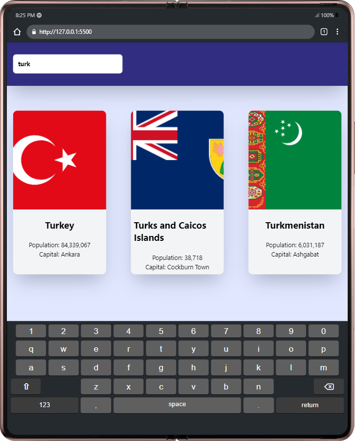
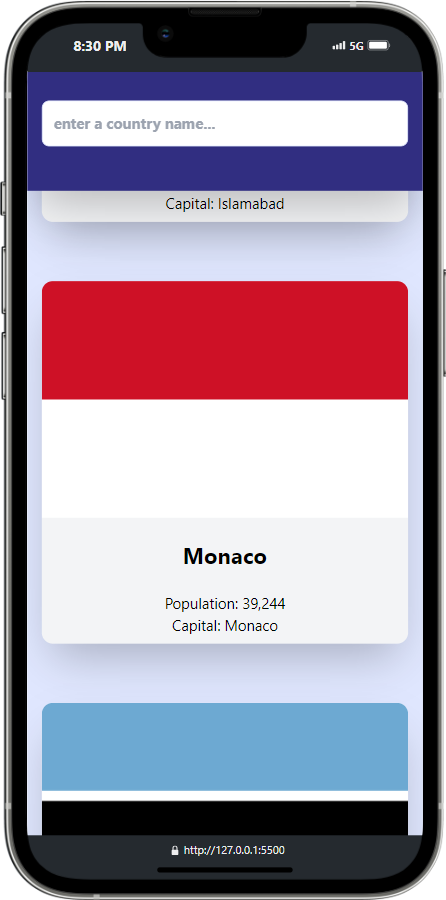

# country-guide

This project is a Country Guide developed using Tailwind CSS and Vanilla JavaScript. This application allows users to access basic information about countries.

## Features

- List of country information
- View detailed information about each country
- Search and filter functionality
- Modern and responsive design

## Screenshots

### Tablet Preview



### Mobile Preview



## Technologies

- Tailwind CSS
- HTML
- Vanilla JavaScript

## Installation

### Prerequisites

Make sure you have Node.js and npm (or yarn) installed on your computer.

### Installation Steps

1. Clone this repository:

```bash
   git clone https://github.com/CemWebDev/country-guide.git
```

2. Navigate into the project directory:

```bash
   cd country-guide
```

3. Install the necessary dependencies:

```bash
   npm install
```

4. For Tailwind CSS setup and customization, refer to the [Tailwind CSS Documentation](https://tailwindcss.com/docs) for detailed information on configuration and usage.

## Usage

1. The home page lists countries.
2. You can search for a country by typing its name into the search bar.
3. Click on a country to view detailed inf


## Contributing

Fell free to contribute by creating issues or pull requests. Your contributions are welcome! 